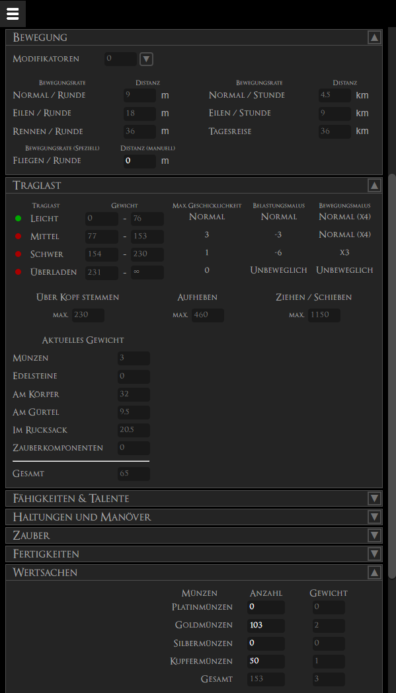

# Introduction
This symbiote enables you to manage your D&D characters directly in Talespire.
So there's no need anymore to use an external spreadsheet in parallel.

## Start
When starting the Symbiote, you'll see a fresh blank character sheet.
You may directly start to fill it out and use it.

## The menu
The menu allows you to manage your characters.

### General options
#### List your existing characters
You'll see the name, owner and Symbiote version of the character.
#### Create a new character
This will simply reset the sheet to start over from scratch. (Don't forget to save your potentially already open character)
#### Import a character
If you exported previously a character or got one provided, you can import it through this. It'll open a file selector in the background.
If the imported character isn't up to the version of the Symbiote, it'll be simply converted to the latest version.

### Character options
#### Load character
It'll simply load this character to the sheet. \
Sections will be opened as in the moment when it was persisted.

#### Copy character
By this you may copy a character. That means it's loaded to the sheet, but the unique identifier is not set. This allows you to set a new name or owner and persist a copy. \
**Important** Do not use the same combination of character name and owner, this has to be unique.
#### Export character
In case you'd like to e.g. create a backup or simply transfer it, by this you'll get a JSON formated export of your character.

#### Delete character
Handle with care, this will remove the character, permanently. No backup and it'll be gone forever.
#### Convert character
In case you installed a new version of the Symbiote, your character data and view will most probably not fit the new format. This will convert it to the latest version which can then be loaded as usual. \
*Hint* An outdated version of a character can't be copied or loaded, till it's converted. But you may export it, in case you'd like to have a backup.

## Sheet sections
### Basic information
In this section you may enter basic character data like name, race and experience points.
### Appearance
In this section you'll specify how your character looks like.
### Classes
This section allows you to add as many classes you'd like to and track their levels. \
When adding a magic class here, it'll automatically add it to the spells section.
### Attributes
Set your attributes and potential modifiers.
### Rescue-Checks
Here you'll define your rescue checks. The attributes will be injected from the attributes section automatically. \
[Example](#rescue-checks-attack-sets-and-weapons)
### Attack-Sets
For now this contains the regular close and distance attacks, using your attributes and potentials size modifiers automatically. \
[Example](#rescue-checks-attack-sets-and-weapons)
### Weapons
In this section you can add all your weapons. This includes for example adding the damage dices, descriptions or marking them as active or not. \
Also you'll be able to directly throw the dices for the attack or damage. \
[Example](#rescue-checks-attack-sets-and-weapons)
### Combat-Maneuvers
This sections contains the offensive and defensive combat maneuvers.
### Initiative
Quite self explaining, you'll be able to define and throw your initiative from this section.
### Inspiration
In this section you can simply note the current inspiration value and the maximum.
### Armors
Similar to weapons, this section allows you to create your armors and shields and pick the ones you're currently wearing. The armor modifiers will be automatically applied. \
Of course you're able to set all the AC modifiers you have. \
[Example](#armor-and-hitpoints)
### Hitpoints
This section enables you to keep track of your hitpoints, from where you got them and how injured you are. \
[Example](#armor-and-hitpoints)
### Movement
Simple but important, the section tells you how far you're able to move at each speed, with your current load. \
[Example](#movement-and-carrying)
### Carrying
This section provides you an overview of all your weights and how light or heavy loaded you are, including the impacts it has on your character. \
[Example](#movement-and-carrying)
### Abilities / Feats
In this section you may define and describe all your abilities. \
[Example](#abilities--feats-and-stances--maneuvers)
### Stances & Maneuvers
Here you'll have two sub sections. \
You may define the stance you know and mark the current active one. \
As well as your maneuvers and if they are currently e.g. prepared or used. \
[Example](#abilities--feats-and-stances--maneuvers)
### Spells
On of the main section for all casters.
You'll have an overview per caster class of how many spells your allowed to learn and cast per day. \
As well as list where you may define all your spells, if they are currently active, prepared and so on.
### Skills
When first opening this section, you'll need to pick your skill set. Afterwards you'll get all the skills of that set where you can set your ranks, if you're allowed to learn that many skills. Attributes are applied automatically and if you're marking a skill as primary for you're char, you'll also get the +3 bonus. \
[Example](#skills-1)
### Valuables
In this section you'll define all the coins and gems you own.
### Equipments
While in this section you'll define all the other items you own. \
Marking an item "green" means you're currently carrying it, which adds it's weight to your char.
### Familiars
If you've any familiar, you may define it in this section.
### Story
Most important for every char, what's his story.
### Contacts
And second most important, which are your contacts. Never again forget someone you met and where.
### Notes
For all random notes.
### Dice-Sets
If all the sections above didn't provide the feature your need to roll again and again, this is your last resort where you're able to name and define any dice set you need. \
Sets are validated to contain only valid dices, but you're free to call them **D**ice or **W**ürfel (German)

## Example section views
### Rescue-Checks, Attack-Sets and Weapons

### Armor and Hitpoints

### Movement and Carrying

### Abilities / Feats and Stances & Maneuvers

### Skills

## Example of throwing a dice
### Attack-Sets with expanded modifiers

### Result of the dice throw

### History of dice throws
